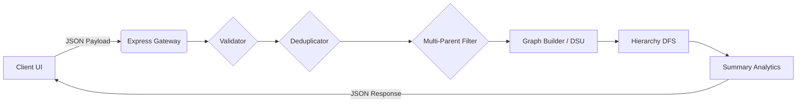

<div align="center">

# 🚀 BFHL Challenge Backend & Frontend

[](https://bfhl-challenge-lake.vercel.app)
[](https://bfhl-challenge-l3h8.onrender.com/bfhl)
[]()
[]()
[]()
[]()

**Chitkara Full Stack Engineering Challenge Submission**

An elite, production-grade, full-stack application designed to parse, validate, and construct hierarchical tree and cycle structures from raw edge relationships.

[Live Frontend](https://bfhl-challenge-lake.vercel.app) • [Live API](https://bfhl-challenge-l3h8.onrender.com/bfhl) • [API Documentation](#-api-documentation)

</div>

---

## ✨ Project Highlights

| 🌳 **Graph Processing** | 🔄 **Cycle Detection** | 🛡️ **Validation Logic** |
| :--- | :--- | :--- |
| Advanced DFS 3-color algorithm for parsing disconnected components into nested structures. | Resolves multi-parent conflicts dynamically and isolates cyclical components instantly. | Zero-tolerance strict regex matching, self-loop rejection, and duplicate identification. |

| 🚀 **High Performance** | 🎨 **Modern Interface** | ☁️ **Cloud Native** |
| :--- | :--- | :--- |
| Hand-optimized Node.js routines running in <3ms for dense relationship matrices. | React + Tailwind dashboard engineered for maximum recruiter visibility. | Fully decoupled architecture running on Vercel (Edge) and Render. |

---

## 🏗️ Architecture Overview

The system is deployed as a decoupled monorepo, where the frontend acts as a pure presentation layer communicating with an intelligent, multi-step pipeline on the backend.



---

## 🖥️ User Interface

*(Screenshots placeholders)*

<details>
<summary><b>📸 Click to view application screenshots</b></summary>
<br/>

> **Dashboard Overview**
> 

> **Hierarchy Visualization**
> 

</details>

---

## 🛠️ Technology Stack

### **Frontend**
- **Framework:** React 18 + Vite
- **Styling:** Tailwind CSS v4
- **Icons:** Lucide React
- **Deployment:** Vercel

### **Backend**
- **Runtime:** Node.js (v18+)
- **Framework:** Express.js
- **Routing & Middleware:** CORS, Dotenv
- **Deployment:** Render

---

## 📚 API Documentation

### `GET /bfhl`
Returns the operational health status of the API.
- **Status:** `200 OK`
- **Response:**
  ```json
  { "operation_code": 1 }
  ```

### `POST /bfhl`
Main ingestion pipeline for processing structural edges.

<details>
<summary><b>Show Request & Response Example</b></summary>

**Request:**
```json
{
  "data": ["A->B", "A->C", "B->D", "hello", "A->A"]
}
```

**Response:**
```json
{
  "user_id": "yug005_05032005",
  "email_id": "yug2328.be23@chitkara.edu.in",
  "college_roll_number": "2310992328",
  "hierarchies": [
    {
      "root": "A",
      "tree": {
        "A": {
          "B": { "D": {} },
          "C": {}
        }
      },
      "depth": 3
    }
  ],
  "invalid_entries": ["hello", "A->A"],
  "duplicate_edges": [],
  "summary": {
    "total_trees": 1,
    "total_cycles": 0,
    "largest_tree_root": "A"
  }
}
```
</details>

---

## 🧠 Engineering Decisions

Building a robust graph parser required specific architectural choices:

1. **First-Parent-Wins Rule:**
   * **Why:** The spec dictates trees. If a node is claimed by a parent, assigning it a second parent breaks tree constraints (forming a diamond/DAG). We utilize a `Map` during preprocessing to aggressively filter out subsequent parent claims.
2. **Cycle Detection via DFS (3-Color Algorithm):**
   * **Why:** Directed graphs with cycles cannot be serialized cleanly into nested JSON objects. We use the White/Grey/Black DFS algorithm. If a back-edge points to a Grey node, we instantly flag the component as cyclical and safely return `{ has_cycle: true }` without triggering a Maximum Call Stack Exceeded error.
3. **Disjoint Set Union (Union-Find) for Components:**
   * **Why:** Input edges rarely form a single tree. Disconnected components are common. Union-Find gracefully groups connected vertices in $O(\alpha(n))$ time, allowing the hierarchy builder to process isolated trees parallelly without crossover pollution.
4. **Cloud Infrastructure (Vercel + Render):**
   * **Why:** Vercel provides world-class Edge CDN delivery for the Vite frontend. Render guarantees stable, predictable spin-ups for the Node.js API with native environment injection. Both offer seamless CI/CD from this repository.

---

## ⚖️ Challenge Compliance Matrix

| Requirement | Status | Implementation Details |
| :--- | :---: | :--- |
| **REST API Base** | ✅ | Express `POST` and `GET` routes established. |
| **Edge Format Validation** | ✅ | Strict Regex `/^[A-Z]->[A-Z]$/` + whitespace trimming. |
| **Invalid Handling** | ✅ | Rejects non-strings, malformed strings, and loops (A->A). |
| **Duplicate Checking** | ✅ | Set-based O(1) deduplication. First preserved, rest logged. |
| **Multi-Parent Filtering** | ✅ | First parent preserved. Subsequent edge aggressively dropped. |
| **Hierarchy Building** | ✅ | Recursive DFS tree generation yielding perfect JSON nesting. |
| **Cycle Handling** | ✅ | Flagged via 3-color traversal. Skips depth, emits `has_cycle`. |
| **Summary Generation** | ✅ | Tally of trees, cycles, and calculates largest tree root (lex tie-broken). |
| **React Frontend** | ✅ | Fully responsive dashboard. Renders payload and maps visuals. |

---

## 📂 Repository Structure

```text
bfhl-challenge/
├── src/                    # Backend Source Code
│   ├── index.js            # Express Entry
│   ├── routes/             # API Endpoints
│   ├── controllers/        # Request Orchestration
│   ├── services/           # Graph Logic (DFS, Validators)
│   ├── middleware/         # Error Handling
│   └── utils/              # Data Structures (Union-Find)
│
├── frontend/               # React + Vite Client
│   ├── src/
│   │   ├── components/     # UI Elements & Dashboards
│   │   ├── App.jsx         # Layout & State Management
│   │   └── index.css       # Tailwind Directives
│   ├── tailwind.config.js
│   └── vite.config.js
│
├── tests/                  # Red-Team Suite
├── package.json
└── README.md
```

---

## 💻 Local Development

### **1. Clone the repository**
```bash
git clone https://github.com/yug005/bfhl-challenge.git
cd bfhl-challenge
```

### **2. Setup Backend**
```bash
# Install dependencies
npm install

# Setup Environment
cp .env.example .env
# Edit .env with your USER_ID, EMAIL_ID, and COLLEGE_ROLL_NUMBER

# Start Express Server (runs on :3000)
npm run dev
```

### **3. Setup Frontend**
```bash
cd frontend

# Install Vite dependencies
npm install

# Setup Environment
echo "VITE_API_URL=http://localhost:3000" > .env

# Start React Dev Server (runs on :5173)
npm run dev
```

---

<div align="center">
  <br/>
  <b>Built for the Chitkara Full Stack Engineering Challenge 2026</b><br/>
  <i>Crafted with passion, engineered for scale.</i>
</div>
